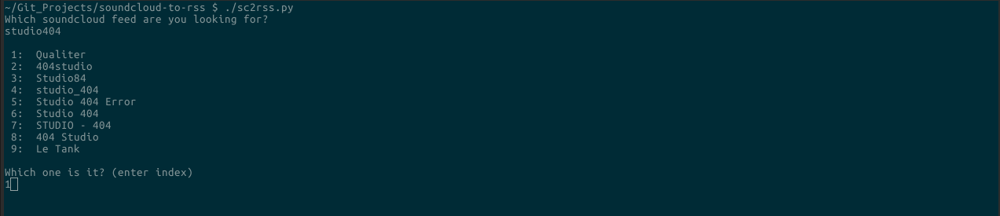

# SoundCloud2RSS

### Simple script outputting the [RSS](https://en.wikipedia.org/wiki/RSS) url for any [SoundCloud](https://soundcloud.com/) channel. This allows to import SoundCloud content into media players with podcast support (such as [VLC](https://www.videolan.org/vlc/)).


#### Works by passing search keywords as arguments. For instance:

```bash
python3 s2rss.py studio404 paris
```

#### Or passing the keywords in program instance:




######	main dependencies: python3, BeautifulSoup4, pyperclip
